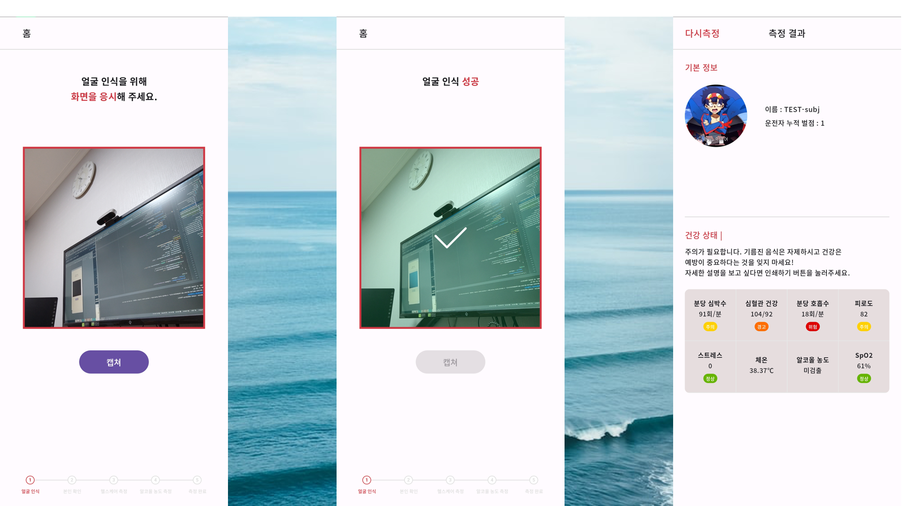
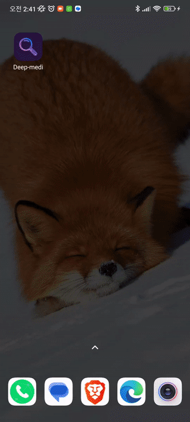

# 딥메디 안드로이드 과제

<br>

```
* 촬영 화면
촬영 버튼을 통해 사진을 촬영 합니다 라이브러리 상관 없음
촬영된 이미지를 를 통해 보냅니다
호출이 성공하면 결과 페이지로 이동합니다

* 결과 화면
API를 호출하여 데이터를 받아온 뒤 결과 화면에 보여줍니다
이미지는 으로 구현합니다
다시 측정 버튼을 누르면 촬영 화면으로 돌아갑니다
심박수 호흡수등 수치에 따라 아래 이미지를 변경합니다 정상 주의 경고 위험
```
## 📱 Feature ##

### 카메라 촬영 및 전송 ###

<br>

## ⚡Stack ##
   

## 📕Used library ##
* CameraX

## 🐾Architecture ##
Clean Architecture 및 MVVM 아키텍처를 멀티모듈 구조에 적용하여, 크게 Data -> Domain <- UI 의 구조를 가지며,
Dagger hilt를 통한 DI를 활용하여 UI에서 필요한 비즈니스 로직을 호출할 수 있습니다.


## License
```
MIT License

Copyright (c) 2023 daryeou

Permission is hereby granted, free of charge, to any person obtaining a copy
of this software and associated documentation files (the "Software"), to deal
in the Software without restriction, including without limitation the rights
to use, copy, modify, merge, publish, distribute, sublicense, and/or sell
copies of the Software, and to permit persons to whom the Software is
furnished to do so, subject to the following conditions:

The above copyright notice and this permission notice shall be included in all
copies or substantial portions of the Software.

THE SOFTWARE IS PROVIDED "AS IS", WITHOUT WARRANTY OF ANY KIND, EXPRESS OR
IMPLIED, INCLUDING BUT NOT LIMITED TO THE WARRANTIES OF MERCHANTABILITY,
FITNESS FOR A PARTICULAR PURPOSE AND NONINFRINGEMENT. IN NO EVENT SHALL THE
AUTHORS OR COPYRIGHT HOLDERS BE LIABLE FOR ANY CLAIM, DAMAGES OR OTHER
LIABILITY, WHETHER IN AN ACTION OF CONTRACT, TORT OR OTHERWISE, ARISING FROM,
OUT OF OR IN CONNECTION WITH THE SOFTWARE OR THE USE OR OTHER DEALINGS IN THE
SOFTWARE.
```
